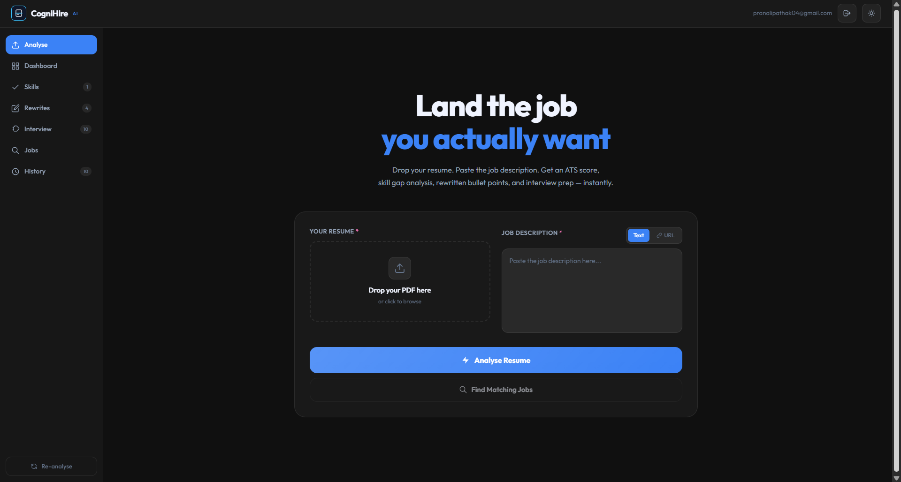
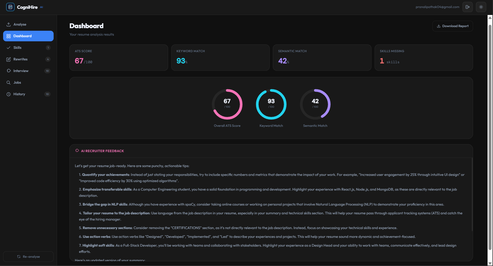
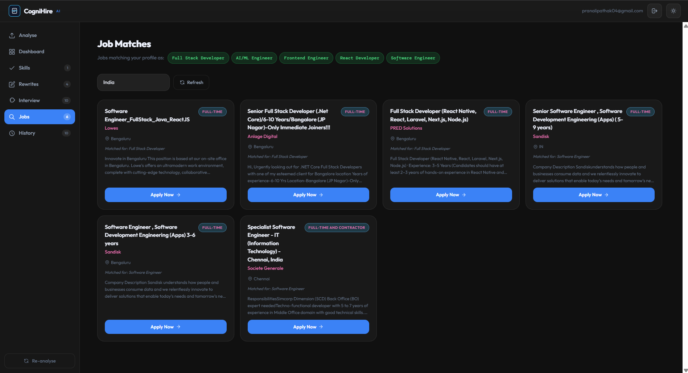
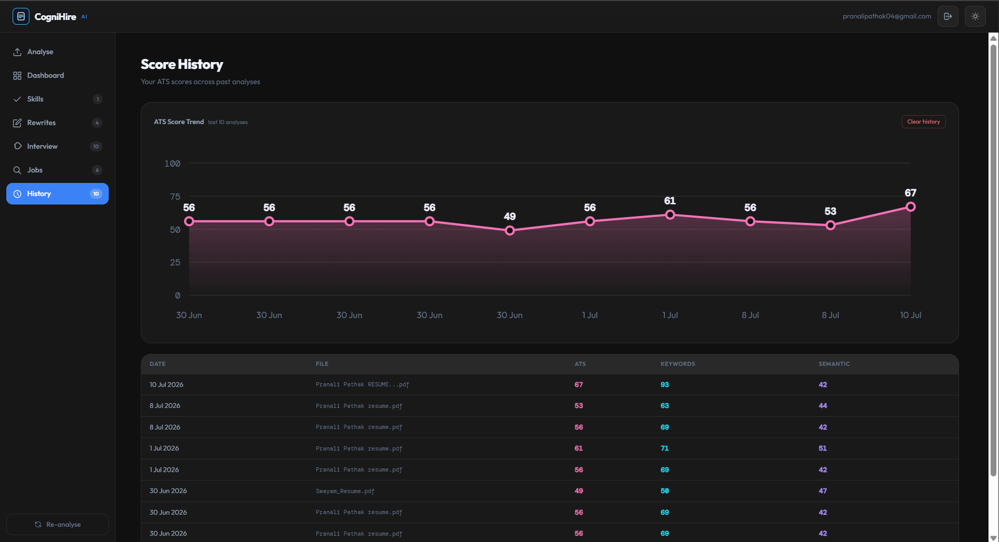

# CogniHire — AI Based Resume Analyser

> Upload your resume. Paste a job description. Get your ATS score, skill gaps, rewritten bullet points, interview prep, and matching job listings — all in one place, with your progress tracked over time.


---

## What It Does

Most resume tools do keyword matching. CogniHire goes further:

- **ATS Scoring** — Hybrid score combining keyword match + semantic similarity (sentence-transformers)
- **Skill Gap Analysis** — Custom-trained spaCy NER model extracts skills from both resume and JD, identifies what's missing
- **AI Feedback** — Groq (Llama 3.3 70B) gives actionable recruiter-style feedback
- **Resume Rewrites** — Weak bullet points selectively rewritten (only where genuinely needed) to better highlight real, already-listed skills — never fabricated metrics or invented achievements
- **Interview Prep** — 10 role-specific questions (technical, conceptual, behavioral) with one-line answering tips
- **JD Scraping** — Paste a LinkedIn/Naukri/Indeed URL instead of copying the job description manually
- **AI-Predicted Job Matching** — Groq predicts the 5 job roles best suited to a resume, then pulls live listings for each via the JSearch API
- **Score History & Trend Tracking** — Every analysis is saved to Firestore; a dashboard chart shows ATS score progress across resume versions over time
- **PDF Report Export** — Download the full analysis (scores, skills, rewrites, interview prep) as a branded PDF report
- **Authentication** — Email/password and Google OAuth sign-in via Firebase, with analyses tied to your account

---

## Screenshots









---

## Tech Stack

| Layer          | Technology                                                   |
| -------------- | ------------------------------------------------------------ |
| Frontend       | React 19, Vite, Tailwind CSS                                 |
| Backend        | FastAPI, Python 3.12                                         |
| NLP            | Custom spaCy NER model + EntityRuler + skill taxonomy        |
| Embeddings     | `all-MiniLM-L6-v2` via sentence-transformers                 |
| LLM            | Llama 3.3 70B via Groq API                                   |
| PDF Parsing    | PyPDF2 + Tesseract OCR (fallback for scanned PDFs)           |
| JD Scraping    | BeautifulSoup + Requests                                     |
| Job Matching   | JSearch API (RapidAPI) — aggregates LinkedIn, Indeed, Naukri |
| Auth & Storage | Firebase Authentication + Firestore                          |
| Report Export  | jsPDF (client-side PDF generation)                           |

---

## Architecture

```
Resume + JD  →  FastAPI Backend  →  React Frontend  →  Firebase
                 │                    │
   parser.py ─── PDF/OCR extraction   Sidebar: Dashboard · Skills ·
   scorer.py ─── spaCy NER + SBERT    Rewrites · Interview · Jobs ·
   advisor.py ── Groq (feedback,      History
                  rewrites, roles)    PDF export · Auth · Dark mode
   scraper.py ── JD scraping
   job_search.py ─ JSearch API
```

Full pipeline: resume PDF → text extraction (with OCR fallback) → spaCy NER skill extraction → hybrid ATS scoring (keyword + semantic) → three Groq calls (feedback, rewrites, interview prep) → results rendered across a sidebar-based dashboard, saved to Firestore for history tracking.

---

## Local Setup

### Prerequisites

- Python 3.10+
- Node.js 18+
- Tesseract OCR installed ([Windows](https://github.com/UB-Mannheim/tesseract/wiki) / [Mac](https://formulae.brew.sh/formula/tesseract))
- Groq API key (free at [console.groq.com](https://console.groq.com))
- RapidAPI account with JSearch API subscribed (free tier at [rapidapi.com](https://rapidapi.com))
- Firebase project with Authentication (Email/Password + Google) and Firestore enabled ([console.firebase.google.com](https://console.firebase.google.com))

### Backend

```bash
cd backend
python -m venv venv

# Windows
venv\Scripts\activate
# Mac/Linux
source venv/bin/activate

pip install -r requirements.txt
```

Create a `.env` file inside `backend/`:

```env
GROQ_API_KEY=your_groq_api_key_here
JSEARCH_API_KEY=your_rapidapi_key_here
```

Start the server:

```bash
uvicorn main:app --reload
```

Backend runs at `http://localhost:8000`
API docs at `http://localhost:8000/docs`

### Frontend

```bash
cd frontend
npm install
npm run dev
```

Create a `.env` file inside `frontend/`:

```env
VITE_FIREBASE_API_KEY=your_api_key
VITE_FIREBASE_AUTH_DOMAIN=your_auth_domain
VITE_FIREBASE_PROJECT_ID=your_project_id
VITE_FIREBASE_STORAGE_BUCKET=your_storage_bucket
VITE_FIREBASE_MESSAGING_SENDER_ID=your_messaging_sender_id
VITE_FIREBASE_APP_ID=your_app_id
```

Frontend runs at `http://localhost:5173`

---

## Project Structure

```
CogniHire/
├── backend/          # FastAPI app, spaCy NER model, Groq/scraping/job-search logic
├── frontend/          # React app — components, pages, auth, PDF export
├── screenshots/
└── README.md
```

---

## API Reference

### `POST /analyze`

| Field     | Type | Description                                |
| --------- | ---- | ------------------------------------------ |
| `resume`  | File | PDF resume (required)                      |
| `jd_text` | Form | Job description as plain text              |
| `jd_url`  | Form | Job posting URL (LinkedIn, Naukri, Indeed) |

**Response:**

```json
{
  "score": {
    "ats_score": 79.54,
    "keyword_score": 87.5,
    "semantic_score": 71.59,
    "matched_skills": ["react", "nodejs", "python"],
    "missing_skills": ["mongodb", "docker"]
  },
  "advice": "...",
  "rewrites": "...",
  "interview_questions": "...",
  "resume_text": "..."
}
```

### `POST /jobs`

| Field      | Type | Description                            |
| ---------- | ---- | -------------------------------------- |
| `resume`   | File | PDF resume (required)                  |
| `location` | Form | Job search location (default: "India") |

**Response:**

```json
{
  "predicted_roles": ["Full Stack Developer", "React Developer", "..."],
  "jobs": [
    {
      "title": "Senior React Developer",
      "company": "Example Corp",
      "location": "Bangalore",
      "employment_type": "FULL_TIME",
      "apply_url": "https://...",
      "matched_role": "React Developer",
      "description": "...",
      "required_skills": ["..."]
    }
  ]
}
```

---

## What Makes This Different

## Most resume tools check if keywords match. CogniHire tries to go a step further — understanding skill aliases, scoring on meaning rather than exact words, and rewriting only what genuinely needs fixing without inventing anything new. The idea was to build something that actually helps during a real job search, not just something that produces a score.

## Author

**Pranali Pathak**
[GitHub](https://github.com/PranaliPathak04)

---

_Built from scratch — from a Google Colab notebook to a full-stack production-ready web app with auth, persistent history, and AI-powered job matching._
